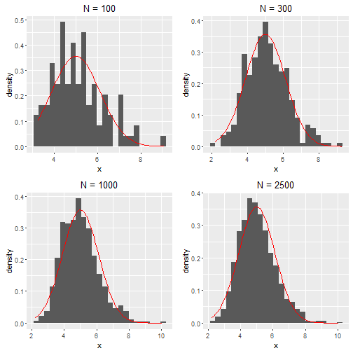

Shiny Application and Reproducible Pitch: Distribution of the mean of the exponential distribution
========================================================
author: Pedro Jesus 
date: Wed Sep 14 19:03:05 2016
autosize: true

Overview
========================================================

Show the Central Limit Theorem in action for the exponential distribution.

Presentation is part of the peer assessment for the Coursera Developing Data Products.

App was build using shiny: https://pjesus7.shinyapps.io/CLTApp/
- One tab has the interface
- Another tab describes what the app does

The code for the app is in the following github url: https://github.com/PJesus7/CourseraShinyApp

This presentation is made on RStudio Presenter.

Goal
========================================================

The goal of this app is to show that increasing the number of simulations the distribution of the mean of exponential distributions leads to a normal distribution.

Also to verify that the mean and standard deviation of these simulations tend to its theoretical values as the number of simulations increases.

Histogram evolution
========================================================

Take $\lambda = 0.2$, $N = 20$.

Conclusion
========================================================

From the histograms and the plot of the theoretical normal distribution (red line) we see that the histogram approaches the line as N increases.

With these graphics it is much easier to show how the CLT works instead of just writing formulas.
