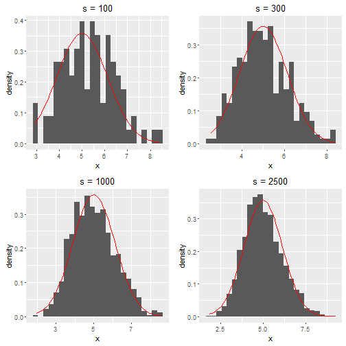

Shiny Application and Reproducible Pitch: Distribution of the mean of the exponential distribution
========================================================
author: Pedro Jesus 
date: Wed Sep 14 18:04:31 2016
autosize: true

Overview
========================================================

Show the Central Limit Theorem in action for the exponential distribution.

Presentation is being created as part of the peer assessment for the Coursera Developing Data Products.

App was build using shiny:

This presentation is made on RStudio Presenter.

Goal
========================================================

The goal of this app is to show that increasing the number of simulations the distribution of the mean of exponential distributions leads to a normal distribution.

Also to verify that the mean and standard deviation of these simulations tend to its theoretical values as the number of simulations increases.

Histogram evolution
========================================================

Take $\lambda = 0.2$, $N = 20$.

Histogram evolution
========================================================
